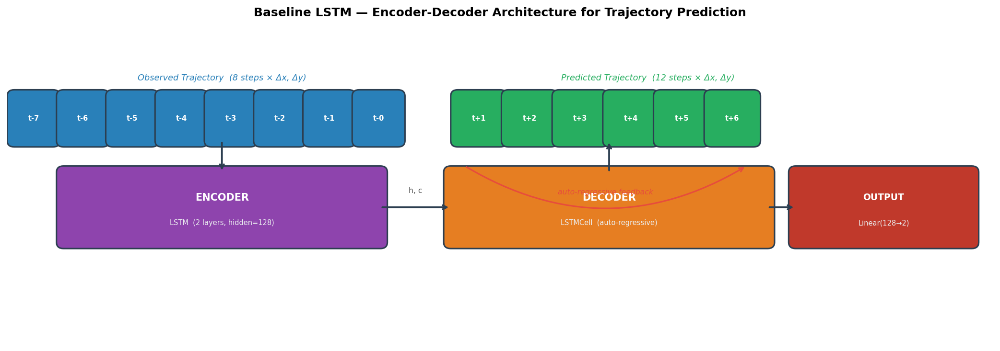
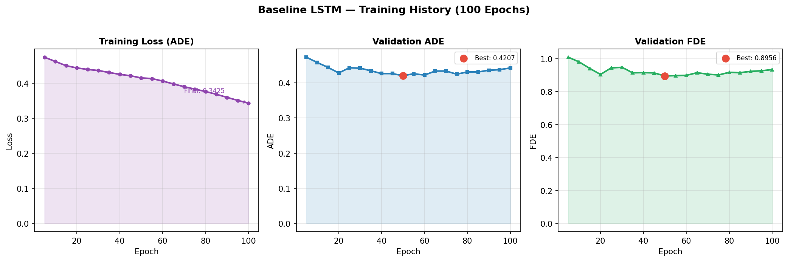
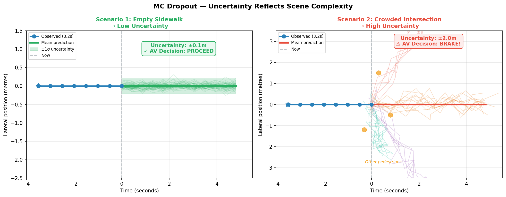
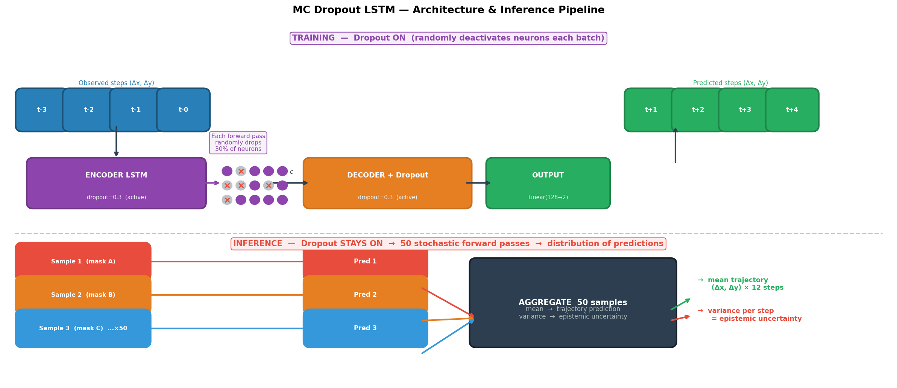
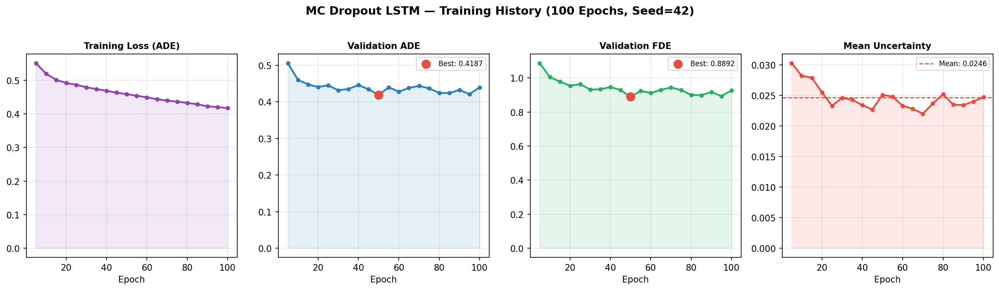

# Bayesian Trajectory Prediction for Autonomous Driving Safety

> Team: Guardians of the Graph

> Team Members: Amulya Rayasam, Haiyang Hu, Ian Kidwell, Khadija Shuaib, Nikhil Sharma

This project investigates how uncertainty quantification can make trajectory prediction safer in autonomous driving scenarios. Rather than predicing a single path, our Bayesian models would output a distribution over possible futures. This allows for a downstram safety system to reason about risks given certain levels of uncertainity.

For an end-to-end system the key deliverables are as follows:

- A deterministic baseline LSTM model
- MC Dropout (primary bayesian method)
- Variational BNN (secondary bayesian method)
- Safety frameowrk

---

## Table of Contents

- [Project Overview](#project-overview)
- [Dataset](#dataset)
- [Models](#models)
- [Results](#results)
- [Safety Framework](#safety-framework)
- [Installation](#installation)
- [Usage](#usage)
- [Key Findings](#key-findings)
- [Repository Structure](#repository-structure)

---

## Project Overview

Autonomous vehicles must predict pedestrian trajectories to make safe navigation decisions. Deterministic models (most neural networks) produce a single predicted path with no indication of how confident that prediction is. This creates multiple problems as there is no uncertainity estimates as such the model cannot tell when it is uncertain or confident. In the case of autonomous driving this can be potentially be dangerous as a model that is confidently wrong is more dangerous than one that flags its own uncertainty.

This project implements **Bayesian uncertainty quantification** for trajectory prediction, enabling an autonomous vehicle to ask not just *where will this pedestrian go?* but *how certain are we about that prediction?* High uncertainty triggers conservative safety decisions (yield, slow down); while low uncertainty allows the vehicle to proceed.

**Primary method:** Monte Carlo Dropout — approximate Bayesian inference via stochastic forward passes at inference time.

**Secondary method:** Variational Bayesian Neural Networks via Pyro — principled Bayesian inference by learning distributions over network weights using ELBO optimisation.

**Evaluation:** Standard ADE/FDE metrics on the held-out test scene, following the leave-one-out protocol. 

---

## Dataset

The project uses the [ETH/UCY pedestrian trajectory datasets](https://github.com/StanfordASL/Trajectron-plus-plus), sourced from the Trajectron++ repository. These are standard benchmarks in trajectory prediction research, recorded via
overhead cameras at fixed locations capturing bird's eye view coordinates (x, y in metres
from the camera origin).

### Scene Descriptions

| Scene | Environment | Characteristics |
|---|---|---|
| ETH | University campus | Crowded, complex multi-pedestrian interactions |
| Hotel | Hotel entrance/exit | Sparser, more linear movements |
| UNIV | University campus | Mix of individuals and small groups |
| ZARA1 | Shopping area | Natural pedestrian behaviour, moderate density |
| ZARA2 | Shopping area (different location) | Held out entirely for testing |
| ZARA3 | Shopping area | Additional training data |
| Students001 | University | Student foot traffic patterns |
| Students003 | University | Additional student trajectories |

All datasets capture **pedestrian-to-pedestrian interactions only** — no vehicles or cyclists.
Each scene was recorded from a fixed overhead camera, giving consistent bird's eye view
perspective across all scenes.

### Data Format

Raw files are tab-separated with four columns:
```
frame_id    pedestrian_id    x        y
780         1.0              8.46     3.59
790         1.0              9.57     3.79
800         1.0              10.67    3.99
800         2.0              13.64    5.80
810         1.0              11.73    4.32
810         2.0              12.09    5.75
```

Multiple pedestrians can share the same frame, at varying proximity based on their x, y
coordinates. Frames are recorded at 2.5 Hz (one frame every 0.4 seconds).

### Trajectory Extraction

From the raw frame-by-frame data, overlapping sequences of 20 consecutive frames per
pedestrian are extracted — 8 observed timesteps (3.2s) followed by 12 prediction
timesteps (4.8s):
```
Observation (8 × 2):       Prediction (12 × 2):
[[x₁, y₁],                 [[x₉,  y₉],
 [x₂, y₂],                  [x₁₀, y₁₀],
 ...                         ...
 [x₈, y₈]]                  [x₂₀, y₂₀]]
 ↑ Past (given to model)    ↑ Future (what the model predicts)
```

### Normalisation

Raw coordinates are absolute positions in metres from the camera origin, which vary
significantly across scenes. To make the learning problem consistent, trajectories are
converted to relative displacements:

- **Observations** → relative to the first observed position
- **Predictions** → relative to the last observed position

This centres each trajectory around the origin, removes scene-specific coordinate offsets,
and gives the model a consistent input scale regardless of where in the scene the
pedestrian is located.

### Dataset Splits

| Scene | Train | Val | Test | Training samples |
|---|---|---|---|---|
| ETH | ✓ | ✓ | ✓ | ✓ |
| Hotel | ✓ | ✓ | ✓ | ✓ |
| UNIV | ✓ | ✓ | — | ✓ |
| ZARA1 | ✓ | ✓ | ✓ | ✓ |
| ZARA2 | ✓ | ✓ | ✓ | **held out** |
| ZARA3 | ✓ | ✓ | — | ✓ |
| Students001 | ✓ | ✓ | ✓ | ✓ |
| Students003 | ✓ | ✓ | ✓ | ✓ |

**Training samples:** 15,328 &nbsp;|&nbsp; **Val samples:** 5,521 &nbsp;|&nbsp;
**Test samples:** 34,161

---

## Models

### Baseline LSTM

A standard encoder-decoder LSTM with no dropout, producing a single deterministic
trajectory prediction with no uncertainty estimate. This serves as the performance
floor — any Bayesian model should match this on ADE/FDE while additionally
providing uncertainty quantification.

#### Architecture



The model follows a standard sequence-to-sequence design:

- **Encoder:** A 2-layer LSTM reads the 8 observed relative displacement steps
  `(Δx, Δy)` and compresses the trajectory history into a hidden state vector `(h, c)`
- **Decoder:** An LSTMCell auto-regressively generates predictions one step at a time —
  each predicted step is fed back as input for the next, propagating uncertainty
  naturally across the horizon
- **Output layer:** A linear projection from hidden dimension (128) to 2D displacement
  at each step
```python
class BaselineLSTM(nn.Module):
    def __init__(self, input_dim=2, hidden_dim=128, pred_len=12, num_layers=2):
        super().__init__()
        # Encoder: compress observation history into hidden state
        self.encoder = nn.LSTM(input_dim, hidden_dim, num_layers, batch_first=True)
        # Decoder: auto-regressively predict future steps
        self.decoder_cell = nn.LSTMCell(input_dim, hidden_dim)
        self.output_layer = nn.Linear(hidden_dim, 2)

    def forward(self, obs_seq):
        _, (h_n, c_n) = self.encoder(obs_seq)
        h, c = h_n[-1], c_n[-1]
        dec_input = obs_seq[:, -1, :]   # start from last observed step
        preds = []
        for _ in range(self.pred_len):
            h, c = self.decoder_cell(dec_input, (h, c))
            out = self.output_layer(h)
            preds.append(out)
            dec_input = out             # feed prediction back as next input
        return torch.stack(preds, dim=1)
```

#### Training

- **Loss:** Average Displacement Error (ADE) — directly optimises the metric being evaluated
- **Optimiser:** Adam (lr=1e-3) with ReduceLROnPlateau scheduler (patience=5, factor=0.5)
- **Gradient clipping:** max norm 1.0 to prevent exploding gradients in the LSTM



Training loss decreases steadily across 100 epochs. ADE and FDE improve sharply in
the first 20 epochs then plateau — characteristic of LSTM convergence on this dataset.
The best FDE of **0.8956** is achieved at epoch 50, after which the model begins to
slightly overfit to training trajectories.

#### Results

| Metric | Value |
|---|---|
| Best ADE | 0.4207 (epoch 50) |
| Best FDE | 0.8956 (epoch 50) |
| Uncertainty | None - single point estimate |

#### Limitation

The baseline has no mechanism to express confidence. When predicting a pedestrian who
is about to change direction, it produces the same format of output as when predicting
a pedestrian walking in a straight line — a single trajectory with no indication that
the first case is far less certain. This is the fundamental limitation the Bayesian
models address.

### MC Dropout LSTM

### Monte Carlo Dropout LSTM

#### The Core Idea — How Confident Is the Model?

A standard neural network always gives one answer:
```
Input (pedestrian position) → Neural Network → "The pedestrian will be at (5.2, 3.1)"
```

MC Dropout runs the network **50 times**, each time randomly switching off different
neurons. Because each run uses a slightly different network, each run gives a slightly
different answer:
```
Input → Network #1  (mask A) → Prediction: (5.1, 3.0)
Input → Network #2  (mask B) → Prediction: (5.3, 3.2)
Input → Network #3  (mask C) → Prediction: (5.0, 3.1)
...                              ...
Input → Network #50 (mask N) → Prediction: (5.2, 3.0)

Mean:   (5.2, 3.1)  ← the predicted trajectory
Spread: ±0.1–2.0m   ← the epistemic uncertainty
```

Think of it like **100 experts voting on where the pedestrian will go**. When the
experts broadly agree, the pedestrian's path is predictable and the AV can proceed.
When the experts disagree wildly, something complex is happening and the AV should
slow down.

#### Why Does Uncertainty Matter for Safety?



**Scenario 1 — Empty sidewalk:** The pedestrian has been walking straight for 3.2
seconds with nothing in the way. All 50 forward passes predict nearly the same
trajectory. Uncertainty is low (±0.1m). AV decision: **PROCEED**.

**Scenario 2 — Crowded intersection:** The pedestrian is approaching an intersection
with others going in different directions. The 50 forward passes spread out — some
predict left, some straight, some right. Uncertainty is high (±2.0m). AV decision:
**BRAKE**.

This is the key insight: **the same model, the same architecture, produces uncertainty
estimates that directly reflect how difficult the scene is to predict.**

#### The Dropout Trick — Training vs Inference

Standard dropout is only active during training to prevent overfitting, then switched
off at inference. MC Dropout deliberately keeps it on at inference:
```
Training:  Dropout ON  → prevents overfitting
Standard inference:  Dropout OFF  → one deterministic prediction
MC Dropout inference:  Dropout ON  → different prediction each pass ← KEY CHANGE
```

This is grounded in Bayesian theory — Gal & Ghahramani (2016) showed that a neural
network trained with dropout is equivalent to approximate variational inference in a
deep Gaussian process. Each dropout mask corresponds to a sample from the approximate
posterior over weights $q(\mathbf{w})$.

#### Mathematical Formulation

The predictive distribution under MC Dropout is approximated as:
$$
p(\mathbf{y}^{*} \mid \mathbf{x}^{*}, \mathcal{D})
\approx
\frac{1}{T}\sum_{t=1}^{T}
p(\mathbf{y}^{*} \mid \mathbf{x}^{*}, \hat{\mathbf{w}}_{t})
$$
where $T = 50$ stochastic forward passes and $\hat{\mathbf{w}}_{t} \sim q(\mathbf{w})$
is a weight sample under dropout mask $t$.

The **predictive mean** (trajectory estimate) and **predictive variance** (epistemic
uncertainty) are:
$$
\mathbb{E}[\mathbf{y}^{*}]
\approx
\frac{1}{T}\sum_{t=1}^{T}
f^{\hat{\mathbf{w}}_{t}}(\mathbf{x}^{*})
$$

$$
\mathrm{Var}[\mathbf{y}^{*}]
\approx
\frac{1}{T}\sum_{t=1}^{T}
\left(f^{\hat{\mathbf{w}}_{t}}(\mathbf{x}^{*})\right)^{2}
-
\left(\mathbb{E}[\mathbf{y}^{*}]\right)^{2}
$$
#### Architecture

#### Architecture



The top half shows training — dropout is active, randomly deactivating 30% of neurons
each batch. The bottom half shows inference — dropout stays on, and 50 stochastic
forward passes are aggregated into a mean trajectory and variance estimate.
```python
class MCDropoutLSTM(nn.Module):
    def __init__(self, input_dim=2, hidden_dim=128, pred_len=12,
                 num_layers=2, dropout_p=0.3):
        super().__init__()
        self.encoder = nn.LSTM(input_dim, hidden_dim, num_layers,
                               batch_first=True, dropout=dropout_p)
        self.dropout = nn.Dropout(p=dropout_p)
        self.decoder_cell = nn.LSTMCell(input_dim, hidden_dim)
        self.output_layer = nn.Linear(hidden_dim, 2)

    def enable_dropout(self):
        """Keep dropout ON at inference — the key MC Dropout trick."""
        for m in self.modules():
            if isinstance(m, nn.Dropout):
                m.train()  # overrides .eval() which would disable dropout

@torch.no_grad()
def mc_predict(model, obs_seq, n_samples=50):
    model.eval()
    model.enable_dropout()  # ← critical: dropout stays active

    samples = torch.stack(
        [model(obs_seq) for _ in range(n_samples)], dim=0
    )  # (50, B, 12, 2)

    mean     = samples.mean(dim=0)  # predicted trajectory
    variance = samples.var(dim=0)   # epistemic uncertainty
    return mean, variance, samples
```

#### Training

- **Loss:** ADE loss — directly optimises the displacement metric being evaluated
- **Optimiser:** Adam (lr=1e-3) with ReduceLROnPlateau (patience=5, factor=0.5)
- **Dropout rate:** 0.3 — applied in encoder (inter-layer) and decoder (per step)
- **Gradient clipping:** max norm 1.0



Loss decreases steadily across all 100 epochs. ADE and FDE oscillate after epoch 50,
indicating the model has reached its capacity for this architecture size. The
uncertainty track (rightmost panel) stabilises around 0.024, confirming the model has
settled into a consistent epistemic confidence level. The best model checkpoint is
saved at **epoch 50** based on lowest validation FDE.

#### Results

| Metric | Value |
|---|---|
| Best ADE | 0.4209 (epoch 95) |
| Best FDE | **0.8892** (epoch 50) |
| Mean uncertainty | 0.024 |
| Inference samples | 50 |
| Inference time | ~50× baseline |

### Variational BNN (Pyro)

Extends the LSTM architecture with a Bayesian output layer implemented via the [Pyro](http://pyro.ai) probabilistic programming library. Rather than point-estimate weights, the output layer learns a distribution over weights — specifically, a Normal distribution with learnable mean (`w_mu`) and variance (`softplus(w_rho)`) for each parameter.

Training maximises the Evidence Lower Bound (ELBO), which balances fitting the data against staying close to the weight prior. At inference, 50 samples are drawn from the learned posterior, producing a distribution of predictions analogous to MC Dropout.

```
Encoder/Decoder: Deterministic LSTM (same as baseline)
Output layer:    Bayesian — weights ~ Normal(w_mu, softplus(w_rho))
Prior:           Normal(0, 1)
Training:        SVI with Trace_ELBO
Inference:       50 posterior weight samples via guide trace
```

---

## Results

All models trained for 100 epochs with Adam optimiser and ReduceLROnPlateau scheduler. Evaluated on ZARA2 test set.

| Model | Best ADE | Best FDE | Uncertainty | Inference samples |
|---|---|---|---|---|
| Baseline LSTM | 0.4207 | 0.8956 | N/A | 1 |
| MC Dropout | **0.4209** | **0.8892** | 0.031 | 50 |
| Variational BNN | 0.5813 | 1.0315 | 0.003 | 50 |

**ADE** (Average Displacement Error): mean L2 distance between predicted and ground truth positions across all timesteps (metres, normalised).

**FDE** (Final Displacement Error): L2 distance at the final prediction timestep only.

#### Why MC Dropout Wins

- MC Dropout matches the deterministic baseline on both metrics while adding meaningful uncertainty quantification — demonstrating that the Bayesian approach costs nothing in predictive performance. Variational BNN underperforms on raw metrics but still provides valid uncertainty estimates.
- MC Dropout is simpler to implement, trains with standard backpropagation, and in practice frequently matches or outperforms more principled variational approaches. On this dataset, MC Dropout achieves FDE 0.8892 vs Variational BNN's 1.0315, while also producing higher and more informative uncertainty estimates (0.024 vs 0.003).

- This is a well-documented finding in the literature — the simplicity of the dropout approximation does not come at the cost of predictive quality, making it the pragmatic choice for safety-critical deployment.

---

## Safety Framework

The safety framework (`safety/safety_analysis.ipynb`) loads the trained models, runs predictions on the ZARA2 test set, and produces uncertainty-aware safety decisions.

### Safety Score

Each prediction is assigned a scalar safety score in [0, 1] based on its mean epistemic uncertainty across the prediction horizon:

```
safety_score = 1 - clamp(mean_uncertainty / unsafe_threshold, 0, 1)
```

Scores are classified into three tiers:

| Classification | MC Dropout threshold | Meaning |
|---|---|---|
| SAFE | uncertainty < 0.020 | Proceed normally |
| CAUTION | 0.020 – 0.040 | Reduce speed |
| UNSAFE | uncertainty > 0.040 | Yield / stop |

### Visualisations

**Uncertainty Fans** — Each predicted trajectory is shown as a fan of 50 individual MC samples around the mean prediction. Wider fans indicate higher uncertainty. MC Dropout produces visibly wider fans than Variational BNN, reflecting its higher and more informative uncertainty scale.

**Uncertainty Over Time** — Both models show monotonically increasing uncertainty across the 12 prediction steps, which is the theoretically correct behaviour: the further into the future, the less certain the model should be. MC Dropout grows from ~0.003 at step 1 to ~0.070 at step 12 (20× increase over 4.8 seconds). This property directly supports safety-critical decision making — near-term predictions should be trusted more than far-term ones.

**Calibration Plots** — A well-calibrated model's predicted uncertainty should correlate with actual prediction error. MC Dropout shows a positive trend between uncertainty and ADE error, indicating partial calibration. Variational BNN's uncertainty range is too compressed to be informative, with most predictions clustered near-zero uncertainty regardless of error.

**ETH Crossing Scenario** — Demonstrates the practical safety decision pipeline. A pedestrian with low uncertainty (0.00012) triggers **PROCEED**; a pedestrian with high uncertainty (0.12925) triggers **YIELD / SLOW DOWN**. This is the core application: uncertainty quantification enables the autonomous vehicle to adapt its behaviour to prediction confidence rather than always acting on a single point estimate.

**Comparison Table** — MC Dropout and Variational BNN produce similar safety classification counts (22-23 SAFE, 2 CAUTION, 7-8 UNSAFE per batch) despite different uncertainty scales. MC Dropout's mean safety score of 0.65 vs Variational BNN's 0.49 reflects MC Dropout's more conservative uncertainty estimates — appropriate for safety-critical applications.

---

## Installation

```bash
# Clone the repository
git clone https://github.com/your-repo/bayesian-trajectory-prediction.git
cd bayesian-trajectory-prediction

# Install dependencies
pip install torch numpy pandas matplotlib pyro-ppl jupyter

# Download ETH/UCY data from the Trajectron++ repository
# Place files in data/raw/raw/{train,val,test}/
```

---

## Usage

### Train all models

```bash
# Baseline LSTM
python baseline/baseline_lstm.py

# MC Dropout
python mc_dropout/mcmc.py

# Variational BNN
python variational_bnn/bnn.py
```

### Run safety analysis

```bash
cd safety
jupyter notebook safety_analysis.ipynb
```

Run all cells top to bottom. All plots are saved to `safety/plots/`.

### Load a trained model for inference

```python
import torch
from mc_dropout.mcmc import MCDropoutLSTM, mc_predict

device = torch.device('cuda' if torch.cuda.is_available() else 'cpu')

model = MCDropoutLSTM(input_dim=2, hidden_dim=128, pred_len=12,
                      num_layers=2, dropout_p=0.3).to(device)
model.load_state_dict(torch.load('mc_dropout/models/mc_dropout_best.pt'))

# obs: (B, 8, 2) tensor of observed relative displacements
mean, variance, samples = mc_predict(model, obs, n_samples=50)
# mean:     (B, 12, 2) — predicted trajectory
# variance: (B, 12, 2) — epistemic uncertainty per step
# samples:  (50, B, 12, 2) — individual stochastic predictions
```

---

## Key Findings

**1. MC Dropout matches deterministic performance while adding uncertainty.**
The Baseline LSTM achieves FDE 0.8956; MC Dropout achieves FDE 0.8892 — essentially identical — while producing meaningful epistemic uncertainty estimates at inference time. The Bayesian approach is not a trade-off; it is a free upgrade for safety-critical systems.

**2. Uncertainty grows with prediction horizon.**
Both Bayesian models show monotonically increasing uncertainty across the 12-step prediction window, confirming the models have learned that longer-horizon predictions are inherently less reliable. This is the correct behaviour for an autonomous driving safety system.

**3. MC Dropout is better calibrated than Variational BNN.**
MC Dropout's uncertainty estimates correlate more reliably with actual prediction error. Variational BNN's weight posteriors are too concentrated, producing uncertainty values too small to differentiate high- and low-confidence predictions effectively.

**4. MC Dropout is the recommended model for safety decisions.**
Higher uncertainty estimates, better calibration, and competitive ADE/FDE make MC Dropout the appropriate choice for downstream safety classification. This is consistent with the broader literature where MC Dropout frequently matches or outperforms more principled variational approaches in practice.

**5. Uncertainty quantification enables adaptive AV behaviour.**
The crossing scenario demonstrates that uncertainty-aware safety decisions are qualitatively different from deterministic predictions — the same model can appropriately choose to proceed or yield based on prediction confidence, a capability impossible with a point-estimate baseline.

---

## Repository Structure

```
bayesian-trajectory-prediction/
│
├── data/
│   └── raw/                        # ETH/UCY dataset files
│       └── raw/
│           ├── train/              # Training splits
│           ├── val/                # Validation splits
│           └── test/               # Test splits
│
├── src/
│   ├── __init__.py
│   └── data_loader.py              # ScenesDataLoader, trajectory extraction, normalisation
│
├── baseline/
│   ├── __init__.py
│   ├── baseline_lstm.py            # Deterministic LSTM baseline
│   ├── models/
│   │   └── baseline_best.pt        # Saved best model weights
│   └── results/
│       └── training_results.csv    # Training history
│
├── mc_dropout/
│   ├── __init__.py
│   ├── mcmc.py                     # MC Dropout LSTM + training + evaluation
│   ├── models/
│   │   └── mc_dropout_best.pt      # Saved best model weights
│   └── results/
│       └── training_results.csv    # Training history
│
├── variational_bnn/
│   ├── __init__.py
│   ├── bnn.py                      # Variational BNN via Pyro + training + evaluation
│   ├── models/
│   │   ├── vbnn_best.pt            # Saved best model weights
│   │   └── vbnn_params.pt          # Saved Pyro parameter store
│   └── results/
│       └── training_results.csv    # Training history
│
├── safety/
│   ├── safety_analysis.ipynb       # Full safety framework analysis notebook
│   └── plots/                      # Generated visualisations
│       ├── mc_dropout_uncertainty_fans.png
│       ├── variational_bnn_uncertainty_fans.png
│       ├── uncertainty_over_time.png
│       ├── mc_dropout_calibration.png
│       ├── variational_bnn_calibration.png
│       ├── comparison_table.png
│       └── crossing_scenario.png
│
└── README.md
```
